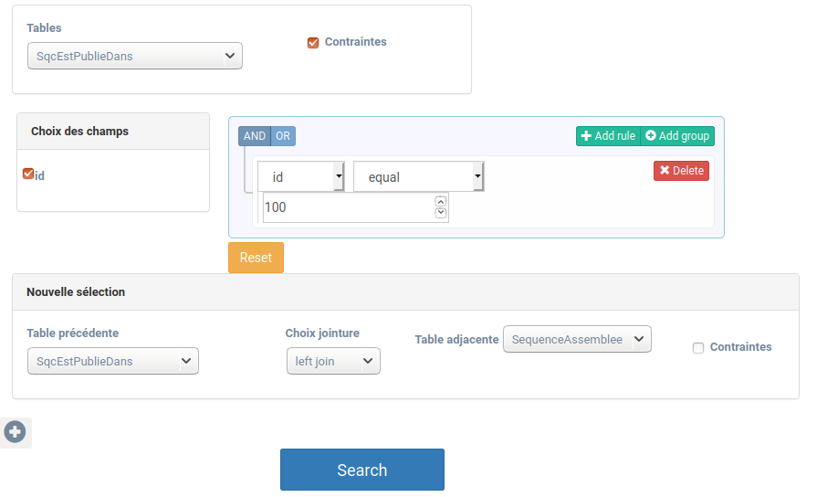

# GOTIT2 - v2.x of GOTIT

GOTIT est un progiciel qui permet de faciliter le suivi de prélèvements d’espèces effectués dans des stations de collecte, à la fois pour la gestion des données d’occurrences et pour l’analyse moléculaire de ces espèces. L'interface web initiale est actuellement accessible sur [https://gotit.cnrs.fr/index.htm](https://gotit.cnrs.fr/index.htm).

Ce prototype est une amélioration de l'interface web pour permettre, via le bundle **Query Builder**, des requêtes flexibles sur la base de données afin de permettre à des collaborateurs n’utilisant pas le SQL de consulter et d’exporter les résultats des requêtes personnalisées. 
 
## Fonctionnalitées du Bundle
>
>

>-`Fonctionnement des requêtes` : 
Pour chaque table choisie l'utilisateur peut lui mettre des **contraintes** et **choisir les champs** à afficher pour le résultat de la requête. 
>
>Par défaut pour la première table choisie, même si l'utilisateur ne met pas de contraintes, tous les champs sont selectionnés par défaut. 
>
>Ensuite, on peut faire des **jointures** (left,right,full join ...) entre une table choisie précedemment et une des ses tables adjacentes en appuyant sur le bouton **+**. On peut aussi ajouter des contraintes. 
>
>-`Les contraintes`: 
Le module **JQuery Query Builder** permet de définir les contraines et des liens logiques (AND,OR ...). Il utilise les champs de la table adjacente choisie.


## Arborescence des fichiers crées pour l'amélioration de l'interface


 * [src]()
    * [Lehna]()
      * [QueryBuilderBundle]()
        * [Controller]()
          * [DefaultController.php]()
        * [Resources]()
            * [public/js]()
              * [main.js]()
              * [results.js]()
            * [views]()
              * [base.queries.html.twig]()
              * [form.html.twig]()
              * [index.html.twig]()
              * [results.html.twig]()
        * [Services]()
          * [QueryBuilderService.php]()
        * [LehnaQueryBuilderBundle.php]()
  * [web]()
    * [bundles]()
      * [LehnaQueryBuilder]()
          * [main.js]()
          * [results.js]()
    * [e3s]()
      * [vendors]()
          * [queryBuilder]()
              * [.js / .css]()
         
 * [README.md](./README.md)
 
 

## Fonctionnement général des fichiers 
 
- Le dossier **views** contient les fichiers **html.twig** qui constituent l'interface utilisateur. L'index est constitué de **form** et **results**. Ainsi, l'utilisateur constitue son formulaire puis obtient son résultat en cliquant sur SEARCH. 

- Le script **main.js** contient le code qui :
>- décrit les comportements sur la page html. 
>- lit le **JSON** (chargé quand la page est chargée) qui décrit les liens dans la base de données. Ainsi, il n'y a pas d'aller-retour vers le serveur à chaque fois que l'utilisateur choisi des tables et/ou champs. 
>- fait le lien vers le **DefaultController.php** quand on clique sur **SEARCH**. **Le script JS permet de résumer l'information saisie dans le formulaire.**

- **DefaultController.php** permet de faire les requêtes sur le serveur grâce aus informations récupérées avec **main.js**. 

- Le module JQuery Builder est dans le dossier vendors.


### Pour tester le code sur l'interface ( Symfony )
 
```
$ docker start gotit-db  ## lancer la base de données

$ php bin/console server:run  ## lancer le serveur


```