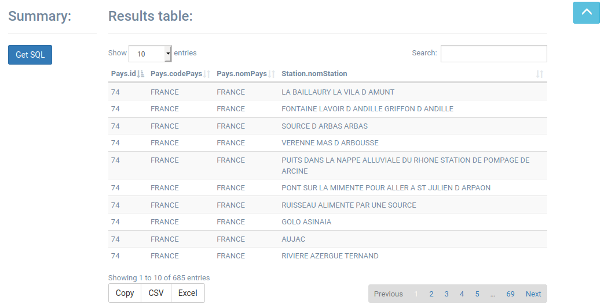

# GOTIT2 - v2.x of GOTIT


GOTIT is a software package that facilitates the monitoring of species samples taken at collection stations, both for the management of occurrence data and for the molecular analysis of these species. The initial web interface is currently accessible on [https://gotit.cnrs.fr/index.htm](https://gotit.cnrs.fr/index.htm).

This prototype is an enhancement of the web interface to allow flexible queries on the database to allow collaborators not using SQL to view and export the results of custom queries. This extension comes as an additionnal module in the project, the **QueryBuilder bundle**

### Developers 

Elsa Mendes, Maud Ferrer et Thierno Diallo 
>
Tutors: Florian Malard et Louis Duchemin


## Bundle Features

### Form interface

>
>
>
>- **How queries work :**
>
>For each selected table, users may set **constraints** and **select the fields** to be displayed in the query result. 
>
>For the first chosen table, even if the user does not check the constraints, all fields are selected by default. If necessary, add constraints to the selected fields and logical links between constraints.
>
>Users may add **joins** (left,right,full join ...) between a previously selected table and one of its adjacent tables (within the logical database model) by pressing the **+** button. Select fields to be displayed and, if necessary, constraints and links.
>
>-Pressing the search button will display the results 
>
>- **The Constraints :** 
>
> The [**JQuery Query Builder**](https://querybuilder.js.org/) module allows to define SQL constraints (such as `where`, `like`...) bounded by logical links (`AND`, `OR` ...). It uses the fields of the selected adjacent table. 
  This module is only one element in the workflow we implemented, allowing to define search constraints on one table at a time. 


  

### Results 

>
>
>The user can :
>
>- get a summary of the SQL and DQL query
>
>- browse or export the result table 


## Treeview of files created for the *Query Builder* bundle


 * [src]()
    * [Lehna]()
      * [QueryBuilderBundle]()
        * [Controller]()
          * [DefaultController.php]()
        * [Resources]()
            * [public/js]()
              * [main.js]()
            * [views]()
              * [base.queries.html.twig]()
              * [form.html.twig]()
              * [index.html.twig]()
              * [results.html.twig]()
        * [Services]()
          * [QueryBuilderService.php]()
        * [LehnaQueryBuilderBundle.php]()

   

## General file operation 


- **QueryBuilderController.php** allows you to make requests to the server using the information retrieved with **main.js**. 

- The script **main.js** contains the code that :
	- describes the behaviors on the HTML page. 
	- reads the **JSON** (loaded when the page is loaded) which describes the structure of the database in the database. This way, there is no round trip to the server each time the user chooses tables and/or fields. 
	- makes the link to the **QueryBuilderController.php** when clicking on **SEARCH**. **The JS script summarizes the information entered in the form.**

- The **views** folder contains the **html.twig** files that make up the user interface. The index consists of **form** and **results**. Thus, the user constitutes his form and then gets his result by clicking on SEARCH. 


## Tools used 

- Programming languages used :  
	*Javascript, CSS, HTML, PHP, Twig*
- Framework Symfony (version 3.4) with Doctrine ORM
- Javascript module : jQuery QueryBuilder, Mustache.JS, DataTable module 


## RoadMap 

- Increment other join functions (right join, full join and cross join)
- Finalize bilingual version of Query Builder
- Allow more advanced queries ( with order by ...)


#### To test the web interface code ( Symfony )
 
```
$ docker start gotit-db ## launch database

$ php bin/console server:run ## start server

```